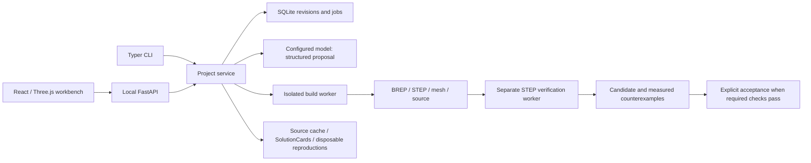

# Architecture

The browser and CLI use one domain service. SQLite stores projects, revisions, branch heads, jobs, events, and export references. Revision artifacts live in a separate application data directory. SolutionScout has its own SQLite library, so research guidance cannot mutate accepted project records.

## Semantic intent and geometry

`DesignSpec` version 1.0 contains units, dimensioned named parameters, parts and transforms, datums, an acyclic feature graph, requirements, assumptions, and soft objectives. Stable feature IDs reference dependencies. The restricted expression parser accepts numeric constants, named parameters, unit names, arithmetic, and parentheses; it never evaluates Python.

The geometry module supports boxes, cylinders, rectangle/circle/polygon extrusion, Boolean composition, axis-aligned hole cutters, rectangular pocket/slot cutters, box/cylinder patterns, fillets/chamfers, transforms, and staged STEP references. Part transforms belong to manufacturing geometry. Viewport operations remain display operations.

Semantic IDs survive edits. BREP face identity and mesh triangle mappings are valid within a build, while geometric edge selectors resolve against the new topology. This is deliberately limited to supported predicates; it is not a general topological naming solution.

## Candidate acceptance

Build and verify are separate processes. The verifier reopens each part STEP and the assembled STEP, checks BREP and solid properties, and measures the supported required constraints. Reports retain actual quantities, expected values, tolerances, units, feature references, measurement method, and an explanation. A mandatory unknown prevents acceptance. File manifests bind exports to their revision and detect stale or swapped files.

Failed, cancelled, and successful candidates remain revision records. Acceptance changes the project's active pointer only after required checks pass. Undo and redo move through accepted revision history; explicit branches retain alternative candidates. Acceptance always uses full required validation.

Geometry compilation can reuse complete unchanged parts from a persistent BREP and mesh cache. Keys include the resolved dependency graph, part transform, imported-file digest, kernel versions, and tessellation settings. Reuse checks file hashes, BREP validity, solid/face counts, volume, and face mappings; corrupt entries cause rebuilding. Changed parts rebuild their full feature graph, and every candidate still exports STEP and undergoes full verification. Individual changed-part intermediate features are not cached across revisions.

The generator and verifier both use CadQuery/OCCT. Separation protects process/state boundaries and forces measurement of exported geometry; it does not provide an independent physical or independent-kernel proof.

## Jobs and local boundaries

The backend dispatches bounded worker processes through a limited queue. It observes timeout, output size, and host resident memory where available, and terminates cancelled or over-budget processes. Restart marks interrupted jobs explicitly; completed revisions and artifacts remain persisted. Kernel work is never run inside the API request process.

The service uses a session token and local origin checks for mutations. Uploaded STEP paths are staged under the import directory. Export paths resolve under the revision artifact directory. Provider keys are server-side configuration and are removed from public settings responses.

## Providers and SolutionScout

The provider uses bounded Chat Completions requests against the user-configured compatible endpoint. Model discovery is requested from `/models`. Response capability is established by trying JSON schema, then JSON mode, then JSON-only text if the endpoint explicitly rejects the response mode. Every response is locally validated against `DesignSpec` or `EditProposal`; returned code is never executed. The proposal records its base revision, changed parameters/features, preserved references, new constraints, and assumptions.

`DesignContext` is a snapshot of canonical revision intent and measurements. `SolutionLibrary` is the persistent source/card cache. Scout retrieves allowlisted documentation and repository files with byte/time/source-count bounds. Lookup and fixed reproductions are model-free. A configured provider and positive model budget enable separately labeled inference over retrieved evidence; private feature graphs, geometry, errors, and invariants enter that request only with explicit authorization. The model can cite only retrieved URLs, and its adaptation remains a sourced hypothesis.

Fixed, shipped reproduction code runs in a disposable subprocess; fetched pages and model-generated code are never executed. A successful box reproduction is applicable only to its recorded dimensions, selectors, operation, and installed versions. Source changes, version changes, and age invalidate tested cards. Watch refresh is cancellable, performs source refresh only, and yields to foreground investigation.
